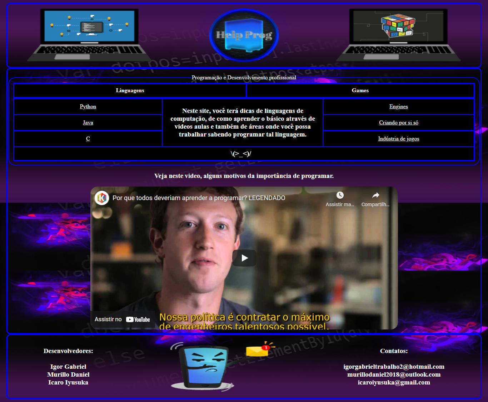
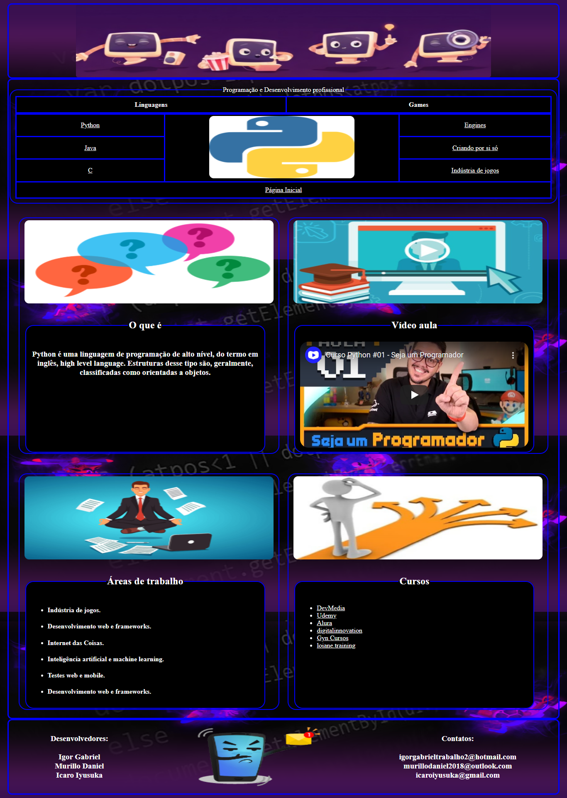
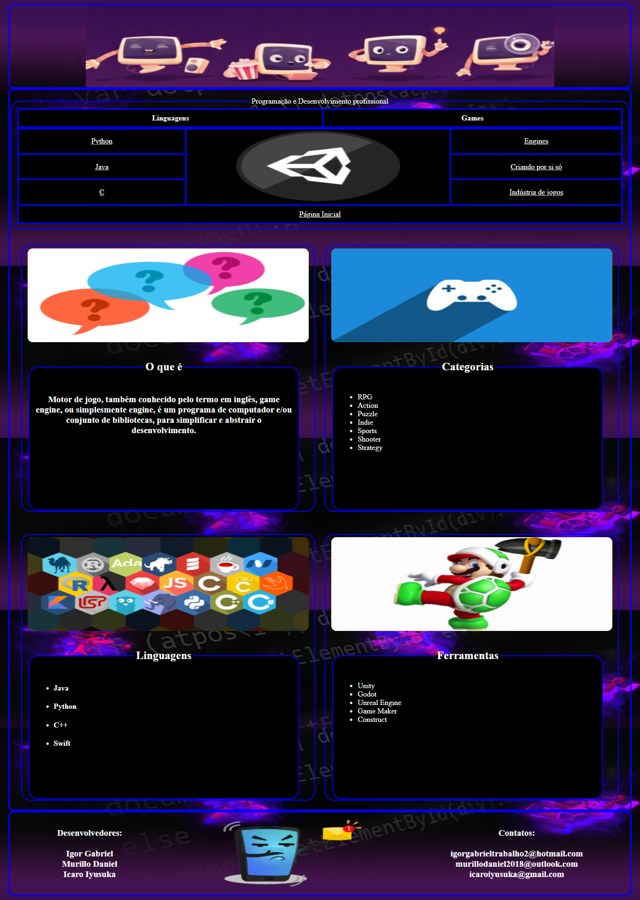

<h1 align="center">Web Design</h1>

<h2>Sobre</h2>

    Um projeto feito para minha matéria de Web Design, um Website que tem como objetivo, auxiliar o usuário na questão de programação como dicas, tecnologias e áreas de trabalho que ele queira estudar, tendo como referência o site w3schools. E assim, podendo ajudar quem está iniciando ou já está habituado com a programação.

<h2>Tecnologias usadas</h2>
<ul>
    <li>HTML5</li>
    <li>CSS3</li>
    <li>JavaScript</li>
</ul>

<h1 align="center">Páginas</h1>
<h2>Página inicial</h2>

<h2>Página de tecnologias</h2>

<h2>Página de informações extras</h2>
